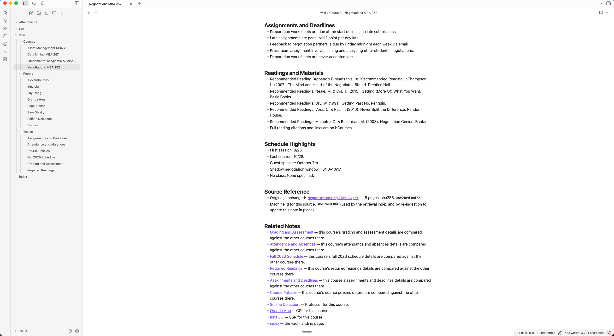
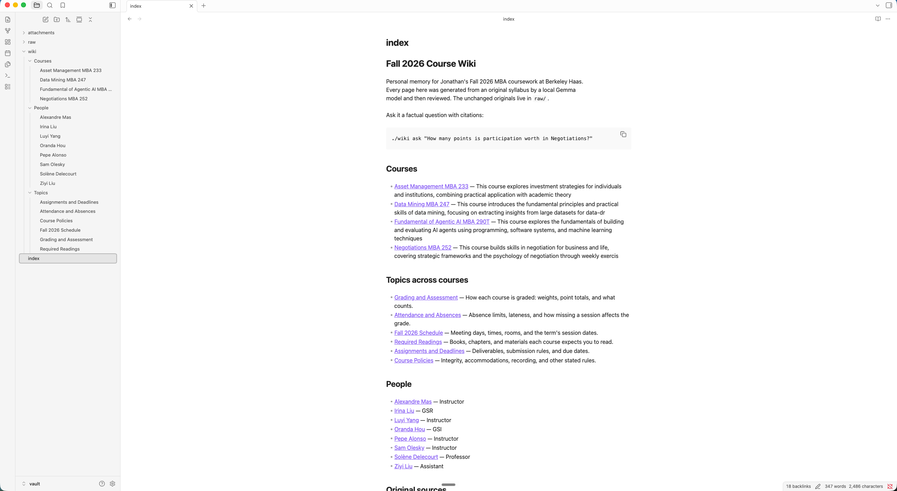
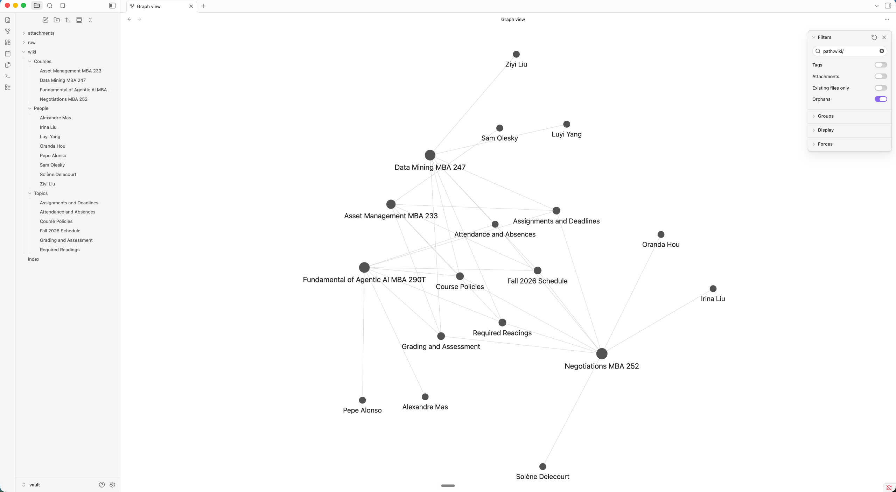

# Fall 2026 Course Wiki — a personal wiki CLI on local Gemma + RAG

A command-line personal wiki over four of my Berkeley Haas Fall 2026 syllabi,
answered by **Gemma 3n E4B running entirely on my laptop**. No cloud service is
involved in any required path: the model, the embeddings, the index and the PDF
parsing are all local, and the whole thing is demonstrated with the internet
switched off.

Built for Class 5, Assignment 4. Everything here is my own CLI and harness — no
sample repository was cloned, and no ready-made document-chat app is used.

```bash
./wiki ask "How many points is global participation worth in the Negotiations course?"
```
```
scope: question names only "Negotiations MBA 252"; evidence limited to that course

Retrieved passages
  [S1] vault/raw/Negotiations Syllabus.pdf (p.2, Course Description)  [raw]  keyword #1 + vector #2
  ...
Answer
ANswer: Global participation is worth 40 points in the Negotiaions course [S4][S5].
        This includes attendance, punctuality, engagement, and the quality of discussion [S4].

Citation check [OK] cited S4, S5 | spelling flags: Negotiaions
```

---

## Contents

| | |
|---|---|
| [1. What this is for, and what is in it](#1-what-this-is-for-and-what-is-in-it) | purpose, sources, how originals map to notes |
| [2. Setup](#2-setup) | exact commands, from nothing to a working CLI |
| [3. Device, model and measurements](#3-device-model-and-measurements) | specs, why E4B, measured memory and response times |
| [4. Commands](#4-commands) | the whole CLI |
| [5. Architecture](#5-architecture) | model vs retrieval tool vs RAG vs harness vs CLI |
| [6. One question traced end to end](#6-one-question-traced-end-to-end) | the path through the code I assembled |
| [7. Design choices](#7-design-choices) | passage size, retrieval, prompts, naming, re-ingestion |
| [8. The wiki in Obsidian](#8-the-wiki-in-obsidian) | required screenshots and how to check the vault |
| [9. Evidence](#9-evidence) | four ask tests, mode checks, offline proof |
| [10. Reflection](#10-reflection) | the real limitation, and what I would do next |
| [11. Optional online mode](#11-optional-online-mode) | how to select it, what it sends |

---

## 1. What this is for, and what is in it

**The problem.** I am taking four courses this term. Each one has its own grading
formula, its own absence rule, its own late-work policy, and its own idea of what
counts as participation. The answers are all written down, in four PDFs I never
open at the moment I actually need them. I wanted to be able to ask *"how many
absences can I take in Asset Management"* in a terminal and get the real number,
with a pointer to the line in the real syllabus.

**What it should answer.** Grading weights and point totals, meeting days/times/
rooms, absence and lateness rules, deadlines and submission rules, required and
recommended readings, and who teaches what. Scope is deliberately small so that
every answer can be checked against a line in a PDF I can read myself.

**Sources** — four Fall 2026 Haas syllabi, preserved byte-for-byte in `vault/raw/`:

| Original (unchanged) | Course | Pages | Generated note |
|---|---|---|---|
| `raw/AgenticAISyllabus.pdf` | Fundamentals of Agentic AI, MBA 290T | 8 | [`wiki/Courses/Fundamental of Agentic AI MBA 290T.md`](vault/wiki/Courses/Fundamental%20of%20Agentic%20AI%20MBA%20290T.md) |
| `raw/Asset Management Syllabus.pdf` | Asset Management, MBA 233 | 4 | [`wiki/Courses/Asset Management MBA 233.md`](vault/wiki/Courses/Asset%20Management%20MBA%20233.md) |
| `raw/Data Mining Syllabus.pdf` | Descriptive and Predictive Data Mining, MBA 247 | 4 | [`wiki/Courses/Data Mining MBA 247.md`](vault/wiki/Courses/Data%20Mining%20MBA%20247.md) |
| `raw/Negotiations Syllabus.pdf` | Negotiations and Conflict Resolution, MBA 252 | 5 | [`wiki/Courses/Negotiations MBA 252.md`](vault/wiki/Courses/Negotiations%20MBA%20252.md) |

**How an original connects to its note.** Ingestion hashes the file's bytes into a
short `source_id` and writes it into the note's front matter, alongside the original
filename, the full sha256, and the page count:

```yaml
---
title: Negotiations MBA 252
source_id: 0be2bed38d
original_filename: Negotiations Syllabus.pdf
source_path: vault/raw/Negotiations Syllabus.pdf
source_sha256: 0be2bed38d72bc6268498c29f5fbdd658cdf0bea02c95beb694cc69675a5df92
source_pages: 5
generated_by: gemma3n:e4b via local (ollama)
review_status: model-generated; 1 reviewed correction(s) re-applied from corrections/wiki-corrections.json
---
```

Each note also carries a **Source Reference** section with a working relative link
back to the PDF, so you can go note → original in one click in Obsidian. The
reverse direction is `./wiki catalog`, which prints the machine id ↔ readable path
mapping for every indexed file. The id is what makes re-ingestion update a note in
place instead of creating a second one.

**Layout.** The split matters: Obsidian only ever sees curated Markdown.

```
vault/                      ← open THIS folder as the Obsidian vault
  raw/                      original PDFs, never modified
  wiki/
    Courses/                one note per syllabus
    Topics/                 6 cross-course topic hubs
    People/                 8 instructional staff
  index.md                  human landing page, grouped by topic
  attachments/              (empty; for embedded images if ever needed)

wiki_cli/                   my harness — ~3,300 lines of Python
instructions/               persona.md, wiki-instructions.md, ingest-instructions.md
corrections/                human corrections re-applied after each ingest
tests/                      the four eval questions + my human assessment
evidence/                   saved runs: ask cards, mode checks, offline proof, failures
.wiki_index/                chunks, vectors, source catalog   ← NOT in the vault
```

Retrieval chunks, embeddings, logs and test records are all outside `vault/`. The
answer key in `tests/` is outside the vault too, so the harness cannot retrieve the
expected answers for its own tests.

---

## 2. Setup

Tested from scratch on the machine described in §3.

```bash
# 1. Local inference runtime
brew install ollama
brew services start ollama                 # or: ollama serve

# 2. Model weights — official Ollama library, download while online
ollama pull gemma3n:e4b                    # generation      7.5 GB on disk
ollama pull embeddinggemma:300m            # embeddings      621 MB on disk

# 3. Python environment (one dependency: pypdf, for local PDF text extraction)
python3.12 -m venv .venv
.venv/bin/pip install -r requirements.txt

# 4. Confirm everything is present BEFORE going offline
./wiki doctor

# 5. Build the wiki and the index from the originals
./wiki ingest ./vault/raw

# 6. Use it
./wiki search "attendance absences"
./wiki ask "What are the graded components of Data Mining MBA 247?"
./wiki chat
./wiki --help
```

`./wiki doctor` is the pre-flight check — it reports whether Ollama is reachable,
whether both models are pulled, whether the index is current, and whether the three
instruction files exist. Run it before disconnecting.

Model weights are **not** committed. They come from the official Ollama library
(`ollama pull gemma3n:e4b`, `ollama pull embeddinggemma:300m`); the exact
identifiers and digests are in §3.

---

## 3. Device, model and measurements

### My machine

| | |
|---|---|
| Model | MacBook Pro, `Mac14,10` |
| OS | macOS 26.6.2 (build 25G83) |
| Chip | Apple M2 Pro, 12 cores (8 performance + 4 efficiency) |
| GPU | Integrated M2 Pro GPU — **unified memory**, no dedicated VRAM |
| Memory | **16 GB unified** (CPU and GPU share it) |
| Free memory at test time | ~5.5–6 GB of the 16 GB actually free |
| Free disk | 388–405 GB |

Apple Silicon has no separate VRAM: the GPU draws from the same 16 GB the OS and my
other apps use. So "will it fit" is a question about total unified memory with the
rest of the machine still running, not about a GPU card's spec.

### Choosing between E2B, E4B and 26B A4B MoE

"B" is billions of parameters — the model's internal weights. Quantization stores
each weight in fewer bits (Q4_0 = 4 bits instead of 16) to shrink it, trading some
quality for memory. Google's **E2B/E4B** names are *effective* parameter counts;
these models also carry extra embedding tables that use memory beyond the effective
count.

| Option | Official Q4_0 load estimate | Verdict on a 16 GB M2 Pro |
|---|---|---|
| Gemma 3n **E2B** | ~2.9 GB | Fits easily, but no need to go this small |
| Gemma 3n **E4B** | ~4.5 GB | **Chosen** |
| **26B A4B MoE** | ~14.4 GB | Rejected |

The MoE is the trap in the naming. It activates about 4B parameters per token, but
fast inference still loads **all 26B weights** — it does not have a 4B memory
footprint. At ~14.4 GB on a 16 GB shared-memory machine it would leave nothing for
the OS, the retrieval index and my other apps, and would swap.

**Why E4B over E2B.** This workload is grounded extraction — copy a point total out
of a table without rounding it, and refuse when the fact is absent. Refusal is the
part small models are worst at, and E4B had headroom on this machine, so I took the
larger of the two that fit. E2B remains a one-line fallback: `WIKI_MODEL=gemma3n:e2b ./wiki ask "..."`.

**Measured, not estimated.** The official ~4.5 GB load figure is not what the
runtime actually holds. Ollama reports E4B resident at **7.7 GB** — the Q4_0 file is
7.5 GB on disk because of those extra embedding tables, plus KV cache. That is the
number that matters for a 16 GB machine, and it is why the MoE was never a candidate.

### Exact model and runtime identity

| | |
|---|---|
| Generation model | `gemma3n:e4b` — Ollama digest `15cb39fd9394`, 7.5 GB on disk, Q4_0 |
| Embedding model | `embeddinggemma:300m` — digest `85462619ee72`, 621 MB, 768-dim vectors |
| Runtime | Ollama **0.34.4** (Homebrew), HTTP API on `127.0.0.1:11434` |
| Processor used | **100% GPU** for both models (Metal, unified memory) |
| PDF extraction | `pypdf` 6.19.0 — pure Python, local, no OCR service |
| Python | 3.12.13 in `.venv` |
| Execution mode | local (default) |

### Measured memory

| | |
|---|---|
| `gemma3n:e4b` resident, `num_ctx` 4096 (ask/chat) | **7.7 GB**, 100% GPU |
| `gemma3n:e4b` resident, `num_ctx` 8192 (ingest) | 7.7 GB, 100% GPU |
| `embeddinggemma:300m` resident | **679 MB**, 100% GPU |
| Both loaded at once (during ingestion) | **≈8.4 GB** of 16 GB unified |
| Harness process itself | ~30 MB peak RSS (stdlib + pypdf only) |
| Index on disk | 924 KB (`.wiki_index/`) for 76 passages + 76 vectors |

≈8.4 GB of 16 GB, with both models GPU-resident and no swapping, is a comfortable
fit. E2B would have left more headroom than this workload needs.

### Measured response times

| Operation | Time |
|---|---|
| `ask`, cold (model not yet loaded) | **10.4 s** total — 9.0 s of which is the model load |
| `ask`, warm | **≈2.0 s** total — retrieval 0.11–0.13 s, generation ≈1.9 s |
| `search`, hybrid (BM25 + vectors) | **0.25 s** |
| `search`, keyword only (`--no-vectors`, no model needed) | **0.11 s** (0.009 s for the search itself) |
| `ingest` one 4-page syllabus (generate note + re-embed all 76 passages) | **23.4 s** |
| `ingest` all four sources from scratch | **143 s** — 4 generation calls (21–42 s each) + 76 embeddings |
| Typical ask prompt size | ~2,470 prompt tokens, 40–90 completion tokens |

Retrieval is ~1% of an ask. Essentially all the wall-clock is the local model.

---

## 4. Commands

```
./wiki doctor                              runtime, models, index and vault health
./wiki ingest ./vault/raw                  read sources → notes → index
./wiki ingest "./vault/raw/one.pdf"        one source only
./wiki reindex [--no-embed]                rebuild the index; --no-embed needs no model
./wiki search "<terms>" [-k N] [--scope raw|wiki|all] [--no-vectors] [--full] [--save]
./wiki ask "<question>" [-k N] [--scope ...] [--test-id ID] [--no-save] [--mode local|online]
./wiki chat [--quiet] [--mode local|online]
./wiki check                               verify links, filenames, headings, corrections
./wiki catalog                             machine id ↔ readable path mapping
./wiki test [--only test-3]                run the four saved ask-mode evals
./wiki --help                              full help, config and layout
```

Inside `chat`: `/ask`, `/search`, `/save`, `/reset`, `/help`, `/exit`.

Environment overrides: `WIKI_MODEL`, `WIKI_EMBED_MODEL`, `WIKI_OLLAMA_HOST`.

Errors are meant to be actionable. With the runtime stopped:

```
$ ./wiki ask "anything"
model error: Cannot reach the local Ollama runtime at http://127.0.0.1:11434.
  Start it with:  brew services start ollama
  Or run in the foreground:  ollama serve
  Search mode does not need the model: try `wiki search "<terms>"`.
```

---

## 5. Architecture

Five things the assignment asks me to keep straight, and where each one lives:

**The model** — `gemma3n:e4b`, running under Ollama on localhost. It generates text
from exactly the instructions and context my code hands it. It does not read my
files, does not remember previous conversations, and does not operate any tool.
Everything it knows about my courses arrived in a prompt I built.
→ `wiki_cli/model.py` is the only file that talks to it.

**The retrieval tool** — code that searches my local index and returns original
passages with source paths. Its job is to find evidence, not to answer. `search`
mode prints its output directly, with no model call at all, which is how I can tell
a retrieval failure apart from a generation failure.
→ `wiki_cli/index.py` (build + BM25), `wiki_cli/retrieval.py` (search + fusion).

**The RAG workflow** — retrieve passages, put them in a prompt, have the model
answer from them. This is `ask` mode. It supplies context at answer time; it does
not train or fine-tune Gemma. Nothing about the model changes.
→ `wiki_cli/modes/ask.py`.

**The harness** — everything else, and the actual substance of this assignment. It
selects the mode, loads the right instruction file for that mode, decides whether a
chat turn needs retrieval, budgets and assembles the prompt, calls the model,
verifies the citations, catches and explains errors, and saves evidence.
→ `wiki_cli/` as a whole.

**The CLI** — the terminal interface over the harness.
→ `wiki_cli/cli.py` and the `./wiki` launcher.

### Module map

| File | Lines | Responsibility |
|---|---|---|
| `cli.py` | 250 | argparse, mode dispatch, `doctor`, `catalog`, error handling |
| `config.py` | 90 | every path, model id and tuning constant in one place |
| `model.py` | 190 | the only model client: Ollama HTTP (stdlib), schema-constrained JSON, optional online |
| `documents.py` | 250 | local PDF/Markdown extraction, heading detection, passage packing |
| `index.py` | 200 | build the index, BM25 from scratch, cosine, source catalog |
| `retrieval.py` | 210 | hybrid search, RRF fusion, course scoping, evidence formatting |
| `prompts.py` | 150 | per-mode prompt assembly, the note JSON schema, the chat router prompt |
| `citations.py` | 140 | citation resolution, reply-form contract checks, spelling flags |
| `wikigen.py` | 430 | note rendering, filename rules, the five accuracy guards, corrections overlay |
| `ingest.py` | 230 | orchestration, dedupe/rename bookkeeping, navigation rebuild |
| `evidence.py` | 150 | evidence cards and transcripts |
| `vaultcheck.py` | 140 | `wiki check`: links, filenames, headings, orphans, stale corrections |
| `evals.py` | 130 | the four-question eval runner |
| `modes/ask.py` | 130 | standalone cited RAG |
| `modes/search.py` | 81 | passages only, no generation |
| `modes/chat.py` | 212 | persona, conversation context, the retrieval router |

### How the three modes differ, enforced in code

| | `chat` | `ask` | `search` |
|---|---|---|---|
| Instruction file loaded | `persona.md` | `wiki-instructions.md` | none |
| Conversation history | last 8 turns | **never** | n/a |
| Retrieval | only when the turn needs a fact | always | is the whole mode |
| Model called | yes | yes | **no** |
| Citations required | when evidence was used | yes, or an explicit refusal | n/a |
| Temperature | 0.6 | **0.0** | n/a |
| Can say "insufficient evidence" | no, that belongs to ask | yes | n/a |

`ask` takes a question string and nothing else. There is no code path by which a
chat message can reach it — that separation is structural, not a matter of prompt
wording. Verified in check 6 of the mode checks: a false exam date asserted in chat
is invisible to `ask` in the same session.

---

## 6. One question traced end to end

`./wiki ask "Who is the GSI for the Asset Management course?"`

1. **`cli.main`** parses `ask`, reads `--mode` (default `local`), calls `modes.ask.run`.

2. **`retrieval.retrieve`** loads all 76 passages from `.wiki_index/chunks.jsonl`.

3. **`retrieval.course_scope`** reads the ingest manifest, builds aliases for each
   course (`"Asset Management MBA 233"`, `"MBA 233"`, `"233"`, `"Asset Management"`),
   and finds exactly one match in the question. The candidate set is cut to the
   Asset Management PDF and its note. **This is the step that makes the refusal
   work** — the Negotiations GSI is no longer in the room.

4. **BM25** (`index.Bm25`, my own ~40 lines) scores every candidate on keyword
   overlap. **`model.embed_local`** embeds the question with `embeddinggemma:300m`
   and cosine-scores the stored 768-dim vectors.

5. **Reciprocal Rank Fusion** combines the two rankings (`1/(60+rank)`), raw passages
   are weighted above wiki passages, a score floor drops weak tail hits, and
   `_diversify` caps any one document at 3 passages. Six hits survive, labelled
   `S1`–`S6`.

6. **`prompts.build_ask_prompt`** loads `instructions/wiki-instructions.md` as the
   system prompt — the research rules, and nothing about a persona. It calls
   `format_evidence_block` to render the hits as a numbered list, each headed with
   its parent document, capped at 6,000 characters total.

7. **`model.generate`** → `require_local_model` (fail fast with instructions if the
   runtime is down) → POST to `127.0.0.1:11434/api/generate` with
   `temperature 0.0, num_ctx 4096`.

8. **`model.detokenise`** normalises the tokenizer's U+2581 space glyph out of the
   reply. **`citations.check`** resolves every `[S…]` marker against the hits that
   were actually retrieved, checks the reply used exactly one of the two permitted
   forms, and flags proper nouns absent from every cited passage.

9. **`evidence.save_ask_card`** writes both JSON and readable Markdown to
   `evidence/ask/`, including every retrieved passage in full.

10. **`modes.ask._print`** shows the scope note, the passages with why each was
    retrieved, the answer, and the citation verdict.

Result: `INSUFFICIENT EVIDENCE: the wiki does not contain the GSI for the Asset
Management course.`

---

## 7. Design choices

### Passage size — ~900 characters, ~150 overlap

One syllabus subsection. Measured: 63 raw passages averaging **764 characters**, 13
wiki passages averaging 630. Smaller chunks retrieve precisely but strand a number
from the sentence that gives it meaning — "40" is useless without "Global
participation". Larger chunks carry context but dilute the keyword signal and eat
the 4,096-token window. The overlap means a fact split across a boundary is still
complete in at least one passage.

Passages are **section-aware**, not blind character windows. `documents.py` detects
headings, attaches the nearest one to every passage, and — because syllabi repeat a
running header on every page — suppresses lines that appear on more than half the
pages before choosing a heading. Without that, every passage in the Negotiations
syllabus was labelled "Delecourt · Negotiations MBA 252 · Fall 2024".

### How much text reaches Gemma

- **Ingestion:** up to **18,000 characters** of one source per call (~4.5k tokens)
  inside a 12,288-token window. Only the 8-page Agentic AI syllabus (18,636 chars)
  is truncated, and its note says so.
- **Ask:** `top_k=6` passages, hard-capped at **6,000 characters** total. Real
  prompts run ~2,470 tokens.
- **Chat:** `top_k=4`, capped at 3,000 characters, plus the last 8 turns.

The whole wiki is never sent. Selecting labelled passages is the point.

### Retrieval — hybrid, because one signal was not enough

**BM25** is excellent at the exact tokens a syllabus question turns on: course
codes, room numbers, point totals. **Local embeddings** score meaning rather than
spelling. They are fused with **Reciprocal Rank Fusion**, which combines *rankings*
so no normalisation between two incomparable score scales is needed.

The hybrid is not decoration. On test-2 — "how many classes can I miss" against a
source that says "more than three absences will adversely affect" — BM25 ranked the
right passage **10th** while the vector half ranked it **6th**. Keyword search alone
would have missed it.

Three refinements, each added in response to an observed failure:

- **Raw outranks wiki** (weights 1.0 / 0.9). Both layers are indexed, but the
  unchanged original is the citable evidence.
- **Score floor** (35% of the top hit). A flat `top_k=6` padded single-source
  questions with four unrelated syllabi — which is how a model ends up citing the
  wrong course.
- **Per-document cap** (3). A two-source question had all six slots taken by the one
  document that matched most strongly, so the second source never reached the prompt.
- **Course scoping.** If a question names exactly one course, only that course's
  original and note are candidates. Two or more courses named, or none, means no
  restriction, so comparison questions still see everything.

Navigation text is **not** indexed: YAML front matter, `## Source Reference` and
`## Related Notes` sections, and the Topic/People hub notes are excluded. They
repeat every course name without stating a fact, and they were outranking real
evidence.

### Research rules vs. assistant personality — separate files, loaded separately

- `instructions/persona.md` — chat only. Voice, an accurate description of what chat
  can actually do, and hard rules: never invent a personal fact, label proposals as
  suggestions, never say "insufficient evidence" to a conversational question, and
  treat something *I* assert as conversation rather than as evidence.
- `instructions/wiki-instructions.md` — ask only. Check the subject of each passage
  before using it; then reply in exactly one of two forms, `ANSWER:` with inline
  citations or `INSUFFICIENT EVIDENCE:`; quote thresholds verbatim; name **all**
  items for a "which…" question. No personality reaches this prompt.
- `instructions/ingest-instructions.md` — ingestion only. The note contract.

The model reads none of these by itself. The harness loads the one file that mode
is allowed to see.

### When chat retrieves — two stages, cheapest first

1. **Rules.** Capability questions ("what can you help me with?"), follow-up edits
   ("make that shorter"), pleasantries and **assertions** ("remember that…") never
   retrieve. Questions containing obvious fact-lookup markers ("how many points",
   "which room", "due date") always do.
2. **A one-word Gemma classifier** for anything still ambiguous — `SEARCH` or `CHAT`,
   `num_predict: 6`.

Chat prints its decision and the reason, so the transcript shows the harness's
reasoning: `[retrieval OFF — rule: user is asserting a fact, not asking for one]`.
When nothing is retrieved, the prompt explicitly forbids `[S…]` markers, because the
model invented one otherwise.

### Note naming and folders

The harness owns filenames; the model only proposes a title. Rules enforced in
`wikigen.clean_note_name`: 2–6 words, no hashes, no timestamps, no export-task
titles, no sentence punctuation, and **the filename and the H1 are the same string**
— so a readable graph label is guaranteed rather than hoped for. Machine ids stay in
front matter, never in a filename. Collisions get a meaningful qualifier
(`Memory - Computers`), never a random suffix.

Three folders, chosen because they fit these sources: `Courses/` (one note per
syllabus), `Topics/` (6 cross-course hubs — Grading and Assessment, Attendance and
Absences, Fall 2026 Schedule, Required Readings, Assignments and Deadlines, Course
Policies), `People/` (8 instructional staff). Guest speakers are listed inside their
course note rather than each getting a one-line page — 15 thin person notes made the
graph unreadable.

Topic hubs, People notes and `index.md` are **assembled by the harness from the
manifest**, not written by the model. That is deliberate: a link the harness builds
cannot point at a note that does not exist, which is why `wiki check` reports 0
broken links across 102 internal links.

### Re-ingestion: no duplicates, no lost review

`source_id` is a content hash of the original file, recorded in
`.wiki_index/ingest_manifest.json`. Re-ingesting the same file finds the same id and
updates the same note. If the model produces a different title, the old file is
deleted, the new one written, and **every incoming `[[wikilink]]` in the vault is
rewritten** (`wikigen.retarget_links`). Stale Topic/People notes are removed. The
retrieval index is derived state, rebuilt from scratch each time, so it cannot
accumulate duplicates by construction.

Verified: four consecutive full ingests, note count steady at 19 (4 course + 6 topic
+ 8 people + 1 index), `wiki check` PASS, no machine-style names.

**Corrections survive regeneration.** I hit this the hard way: my hand-corrections to
a note were silently wiped by the next ingest. `corrections/wiki-corrections.json`
holds reviewed find/replace pairs keyed to a `source_id`, re-applied after the model
writes. Each entry records *why* it exists. Because the model rewords lines between
runs, entries can match by regex, and any entry that stops landing is reported —
during ingestion and by `wiki check` — so review cannot rot unnoticed.

### Model settings that changed results

| Setting | Value | Why |
|---|---|---|
| `ask` temperature | **0.0** | At 0.1 the same question gave a correct refusal on one run and a wrong answer on the next. An unreproducible evidence card is worthless. Three consecutive runs are now byte-identical. |
| `ingest` structured output | JSON schema via Ollama `format` | Prompting for JSON failed outright: Gemma 3n wrote its tokenizer's `▁▁` glyph as indentation and misspelled a key as `summaary`. Constraining decoding fixed it. |
| `ingest` section headings | fixed enum in the schema | Free choice produced a 22-section transcription of a reading table that omitted the grading breakdown entirely. |
| `chat` temperature | 0.6 | Drafting needs some latitude. |
| `num_ctx` | 4096 ask/chat, 8192 ingest | Larger contexts grow the KV cache; 4096 fits ~2.5k-token prompts with room to spare. |

### Five accuracy guards in the harness

The model is wrong in small, repeatable ways. Each guard exists because of an
observed failure, and each reports what it changed:

1. **Title guard** — every 4+ letter word in a note title must appear in the source.
   Caught `Negotiaions MBA 252 Fall 2026` becoming a filename and a graph label.
2. **Name guard** — the same check for people's names. Caught `Alexaandre Mas`.
3. **Prose guard** — repairs capitalised words in bullets that the source never
   uses. Caught `Amaador` → `Amador`, `Ijheh` → `Ijeh`. Skips words in the local
   system wordlist, after an earlier version "corrected" `None specified` to
   `One specified` and inverted a correct sentence.
4. **Privacy guard** — strips emails and phone numbers from note bodies. The
   instructions asked the model not to copy them; it did anyway, and mangled one
   into `olesky@haaas.bberkeley.edu`. A privacy rule that matters belongs in code.
5. **Topic guard** — the model proposes tags, the harness adds any tag with at least
   two explicit matches in the source. It had under-tagged schedule and attendance
   on two of four syllabi.

Full before/after record: [`evidence/fixes/wiki-review-log.md`](evidence/fixes/wiki-review-log.md).

---

## 8. The wiki in Obsidian

**Open `vault/` as the vault** — not the repository root, not the course folder.

**1a. A wiki note: readable filename, matching heading, traceable source**


The tab title, the breadcrumb and the H1 are the same string — `Negotiations MBA 252`
— so the graph label is readable by construction, not by aliasing. Obsidian renders
the YAML front matter as a **Properties** panel, which puts the whole provenance chain
on screen: `source_id` (the content hash re-ingestion keys on), `original_filename`,
`source_path`, the full `source_sha256`, `source_pages`,
`generated_by: gemma3n:e4b via local (ollama)`, and a `review_status` recording that a
human correction was re-applied from `corrections/wiki-corrections.json`.

**1b. The same note, scrolled to its source reference and related notes**



**Source Reference** links back to the unchanged original in `raw/` and repeats the
machine id. **Related Notes** are rendered `[[wikilinks]]`, each with a sentence saying
*why* that topic is relevant — to the six topic hubs, and to the professor, GSI and GSR
for this course. Following one and coming back is the trace described below.

**2. The topic-organized page list and index**



`index.md` is the human landing page: Courses, then Topics across courses, then
People, then the original sources with a link from each PDF to its note. The file
explorer shows the whole vault — `Courses/` (4), `People/` (8), `Topics/` (6) and
`index` — with every link rendered and clickable. Obsidian reports 18 backlinks into
this page.

**3. Graph view with readable labels**



**Filter used: `path:wiki/`, Attachments off.** That hides the four source PDFs, which
would otherwise dominate the view. 18 nodes: 4 course notes, 6 topic hubs, 8 people —
each course sits at the centre of its own cluster of topics and staff, and the topic
hubs are what tie the four courses together.
The filter is presentation only — the filenames underneath are already readable, which
`./wiki check` enforces.

To reproduce them:

1. Obsidian → *Open folder as vault* → select `vault/`.
2. Open `index.md`. It is grouped: Courses, Topics across courses, People, Original
   sources.
3. Click `[[Negotiations MBA 252]]` → scroll to **Related Notes** → click
   `[[Grading and Assessment]]` → that hub links back to all four courses → return
   to the course note → **Source Reference** → click
   `Negotiations Syllabus.pdf` to open the unchanged original.
4. Graph view → filter `path:wiki/` → turn **Attachments off** (so the four PDFs do
   not swamp it) → zoom until labels are readable. Expect 18 nodes: 4 courses, 6
   topic hubs, 8 people.

The filter is presentation only. The filenames underneath are already readable —
`wiki check` enforces that, and it is not a substitute for fixing them.

**Checked mechanically** (`./wiki check`):

```
notes                     19
internal [[links]]        102 resolving
broken internal links     0
unresolvable source links 0
machine-style filenames   0
filenames over 6 words    0
heading/filename mismatches 0
notes with no incoming link 0
reviewed corrections      3 defined, 1 currently applied
originals preserved       4 file(s) in raw/
PASS
```

---

## 9. Evidence

### The four ask-mode tests

Questions, expected sources and expected passages were written **before** the
harness was run against them: [`tests/eval_questions.json`](tests/eval_questions.json).
That file lives outside the vault, so the harness cannot retrieve its own answer key.

| Test | Kind | Machine | Human | Evidence card |
|---|---|---|---|---|
| test-1 | direct, single source | PASS | PASS | [`evidence/ask/`](evidence/ask/) |
| test-2 | answerable, deliberately reworded | PASS | **PARTIAL** | [`evidence/ask/`](evidence/ask/) |
| test-3 | answerable, spans two sources | PARTIAL | PARTIAL | [`evidence/ask/`](evidence/ask/) |
| test-4 | unsupported → expected refusal | PASS | PASS | [`evidence/ask/`](evidence/ask/) |

Every card contains the question, **every retrieved passage in full** with its path,
page and section, why it was retrieved (keyword rank, vector rank), the exact model
identity, local/online mode, the actual answer, the citation verdict, and timings.

**My own assessment, where it differs from the machine's, is in
[`tests/human_assessment.md`](tests/human_assessment.md).** The short version:

- **test-1** — correct (40 points), correctly cited. The model misspells the course
  as "Negotiaions" in its own prose; the harness flags it and does not rewrite it.
- **test-2** — I mark this **PARTIAL even though the machine passes it.** The number
  and the citation are right, but the sentence "You can miss more than three
  absences before it adversely affects the grade" inverts the rule. A mechanical
  citation check cannot evaluate the direction of a threshold; that is exactly why
  the card prints the passage.
- **test-3** — factually correct for both Wednesday courses with the right times,
  and it correctly excluded the two Tuesday courses whose passages were retrieved as
  distractors. PARTIAL because it names Negotiations only as "MBA 252" and drops the
  rooms, and my written expectation asked for the courses to be named.
- **test-4** — refuses correctly and stably. **It failed twice before it passed**,
  answering "Oranda Hou" (the *Negotiations* GSI), once while contradicting itself in
  the next line. The failing runs are kept, unedited:
  [`run-1-before-prompt-fix/`](evidence/ask/run-1-before-prompt-fix/),
  [`run-2-before-contract-fix/`](evidence/ask/run-2-before-contract-fix/),
  [`run-3-before-course-scoping/`](evidence/ask/run-3-before-course-scoping/).
  Prose instructions were not enough; course scoping in retrieval was.

### Retrieval was evaluated before the answers

For each question I ran `./wiki search` first and confirmed the expected passage
appeared, before judging any generated answer. That is how the three retrieval bugs
in §7 were found — and they were fixed in the retriever, not blamed on the model.

### Mode-boundary checks

[`scripts/mode-checks.sh`](scripts/mode-checks.sh) runs all eight in one go and saves
a clean transcript to `evidence/modes/`. Latest local run:
[`evidence/modes/`](evidence/modes/).

| Check | Expected | Result |
|---|---|---|
| 1. chat "what can you help me with?" / "what can we do?" | accurate capabilities, no search, no citations, no refusal | ✅ `[retrieval OFF — rule: capability/meta/follow-up turn]` |
| 2. chat draft, then "make that shorter" | uses the conversation | ✅ `[retrieval OFF]`, shortened its own draft |
| 3. chat: I assert a false exam date | acknowledged as *my* statement, not attributed to a source | ✅ `[retrieval OFF — rule: user is asserting a fact, not asking for one]` |
| 4. chat: a real syllabus question | retrieves and cites | ✅ `[retrieval ON]`, cited `[S1]` |
| 5. `search` | original passages + paths, **no generated answer** | ✅ 3 passages, 0.338 s; and 2 passages in 0.009 s with `--no-vectors` |
| 6. `ask` after that chat | must not know the chat-only exam date | ✅ `INSUFFICIENT EVIDENCE: the wiki does not contain the date of the final exam.` |
| 7. `ask` standalone | neutral, cited | ✅ all four Data Mining components with weights, cited `[S4][S5][S6]` |
| 8. `wiki check` | vault integrity | ✅ PASS |

Check 6 is the important one: the "December 15" date was asserted in chat, exists in
no source, and is invisible to `ask`.

### Offline demonstration

> **Captured:** [`evidence/offline/20260929-212158-offline-demonstration.txt`](evidence/offline/20260929-212158-offline-demonstration.txt) — produced by
> `./scripts/offline-demo.sh` with Wi-Fi off, from a restarted CLI and with both
> models unloaded first, so it is a cold start from weights already on disk.

```bash
# 1. Disconnect
networksetup -setairportpower en0 off

# 2. One unattended script: health check, offline ingest, all four ask tests,
#    all eight mode checks, vault check, with before/after network proof.
./scripts/offline-demo.sh

# 3. Reconnect
networksetup -setairportpower en0 on
```

It is deliberately **one unattended script rather than an interactive session**,
because an AI coding assistant cannot drive this demonstration: the assistant needs
the network that the demonstration requires to be down. Anything it typed for you
would have been run with the internet up. So the script runs alone, and it refuses
to run at all if it can still reach the internet:

```
$ ./scripts/offline-demo.sh
ABORT: the internet is still reachable (HTTP 200 from ollama.com).
       Disconnect first, or this is not an offline demonstration.
```

It also stops both models before starting, so what follows is a genuine cold start
from weights already on disk rather than something still warm in memory.

What it captures, in order:

| Step | Shows |
|---|---|
| Network proof | `networksetup -getairportpower`, active interface count, default route, `curl` to ollama.com / Google's API / api.anthropic.com, `ping 1.1.1.1`, `nslookup` — all failing |
| Local runtime | `127.0.0.1:11434` answering, `ollama ps` empty (cold), `ollama list` showing both local models |
| Step 1–2 | `./wiki doctor` from a fresh process, `./wiki --help` |
| Step 3 | `./wiki ingest` of one syllabus — local Gemma writes the note, and the note count does not change, which is the re-ingestion duplicate check |
| Step 4 | `./wiki catalog` — machine id ↔ readable path |
| Step 5 | `./wiki test` — all four ask-mode tests |
| Step 6 | `./scripts/mode-checks.sh offline` — all eight mode checks |
| Step 7 | `./wiki check` — vault integrity |
| End | network still unreachable |

Nothing in the required path can reach the network: the model and embeddings are
local under Ollama on `127.0.0.1`, PDF extraction is `pypdf` in-process, BM25 is my
own code, and the only HTTP client in the harness is `urllib` pointed at localhost.
There is no hosted embedding call, no remote search and no cloud fallback. The one
outbound code path that exists is `--mode online` (§11), and it is never reached
unless you pass that flag and set an API key.

### Saved evidence, including the failures

```
evidence/
  ask/                        four evidence cards (JSON + Markdown) + eval summary
    run-1-before-prompt-fix/       test-3 PARTIAL, test-4 FAIL — kept unedited
    run-2-before-contract-fix/     the ANSWER+refusal contradiction
    run-3-before-course-scoping/   test-4 regressed to "Oranda Hou"
  modes/                      mode-check transcripts and chat sessions
  offline/                    offline demonstration
  fixes/
    wiki-review-log.md        every failure, its fix, and where the before-state is
    before/                   pre-fix notes, chunk index, vault-check output
  screenshots/                Obsidian screenshots
```

No failed result was replaced with an invented successful one.

---

## 10. Reflection

### The real limitation: a 4B model's refusal is a prompt away from collapsing

The single most important behaviour here is the one the assignment calls out — "no
answer found" as a successful result. It was also the least reliable, and prompt
engineering could not fix it.

Asked *"who is the GSI for Asset Management?"*, retrieval did its job: it returned
the Asset Management syllabus, which names no GSI. It also returned the Negotiations
syllabus, which names Oranda Hou. Gemma 3n E4B saw a passage containing the literal
string "GSI:" and reported it as the answer. On one run it produced the contradiction
in full:

```
The GSIs for the Asset Management course are Oranda Hou [S6].
Closest available: The wiki does not contain the GSIs for the Asset Management course.
```

It asserted the fact and disclaimed it in consecutive lines. I rewrote the research
rules to demand an explicit subject check, and added a forced `ANSWER:` /
`INSUFFICIENT EVIDENCE:` prefix so the decision had to be made before the prose
started. That helped — and then a later run reverted to naming Oranda Hou anyway.

**What actually fixed it was changing the evidence, not the instructions.**
`course_scope()` detects when a question names exactly one course and removes every
other course's passages from the candidate set. The model cannot misattribute a name
it never sees. The refusal has been stable on every run since.

The honest conclusion: **at this model size, do not rely on instructions to make the
model not do something.** Make it structurally unable to. A prompt rule is a
suggestion to a 4B model; a filter is a guarantee. The same lesson repeats across
this project — the five ingestion guards, the JSON schema, the enumerated section
headings, the harness-owned filenames. Every one started as an instruction the model
ignored and became code that does not ask.

Two smaller limitations worth naming:

- **The model misspells its own subject matter.** It writes "Negotiaions" in answers
  and note titles, and mangled names like `Alexaandre Mas` and `olesky@haaas.bberkeley.edu`.
  The guards catch these in generated *notes*; in a generated *answer* they are only
  flagged, never rewritten, because a saved answer must be exactly what the model
  said.
- **A citation check is not a support check.** The harness verifies every `[S…]`
  resolves to a retrieved passage. It cannot tell whether the passage supports the
  sentence — which is how test-2 passes the machine check while inverting the rule it
  is quoting. That gap is why every evidence card prints the full passage text.

### One concrete improvement I would try next

**A retrieve-then-verify second pass, in the harness, one extra local call.**

Right now the answer is the last word. I would add a verification step: for each
sentence in the answer, send just that sentence and just the passages it cites back
to the model with a single question — *does this passage state this claim? YES or NO.*
Any `NO` gets the sentence struck and reported, the same way an invented citation
marker is reported today.

Why this one, concretely:

- It would have caught **test-2**. "You can miss more than three absences before it
  adversely affects the grade" checked against "More than three absences will
  adversely affect the class contribution grade" is a much easier judgement than
  generating the right sentence in the first place — it is a comparison, not a
  composition, and small models are markedly better at that shape of task.
- It closes the exact gap I named above, turning the citation check from
  "the marker resolves" into "the passage supports it".
- It costs about 1–2 s per sentence at the measured warm rate, and stays fully local
  and offline.
- It fits the pattern that worked everywhere else in this project: don't ask the
  model to be more careful, add a structural check it has to get past.

I would also try `gemma3:4b` alongside `gemma3n:e4b` on the same fixed four tests —
the spelling defects and the reply-form drift both look like 3n-specific quirks, and
the harness makes that a one-line comparison (`WIKI_MODEL=gemma3:4b ./wiki test`).

---

## 11. Optional online mode

Not required, not used for any evidence above, and off unless asked for explicitly.

```bash
export GEMINI_API_KEY=...
./wiki ask "..." --mode online
```

It routes through the same harness — same research rules, same retrieval, same
citation checks — swapping only the model call, to a hosted Gemma on Google's
Generative Language API (`wiki_cli/model.py:generate_online`). **What it sends:** the
research-rules system prompt, the retrieved passage text, and the question. That
means passages from my syllabi leave the machine, which is the whole reason it is not
the default.

Without `GEMINI_API_KEY` it refuses with an explanation rather than falling back:

```
--mode online needs GEMINI_API_KEY in the environment.
  Local mode is the default and needs no key.
```

`local` is the default everywhere, and every piece of required evidence was produced
locally with the network down. Any online evidence would be labelled `online` in its
card's Execution field so it cannot be confused with the offline run.
